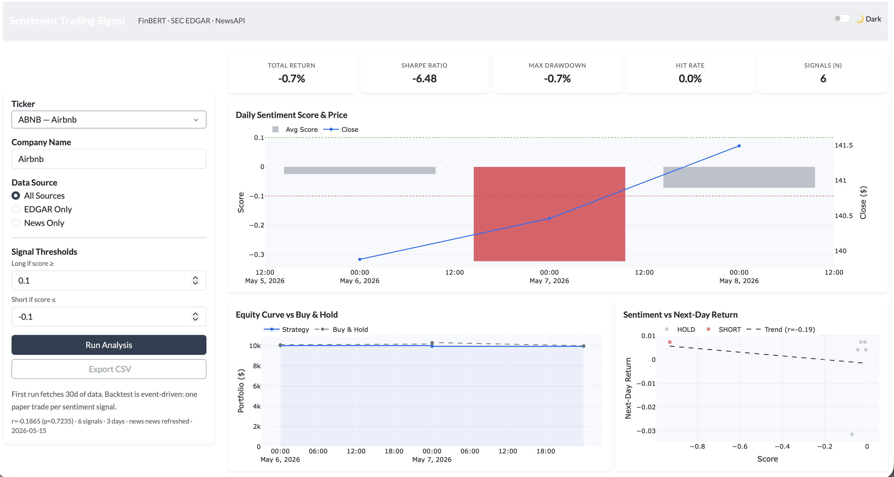
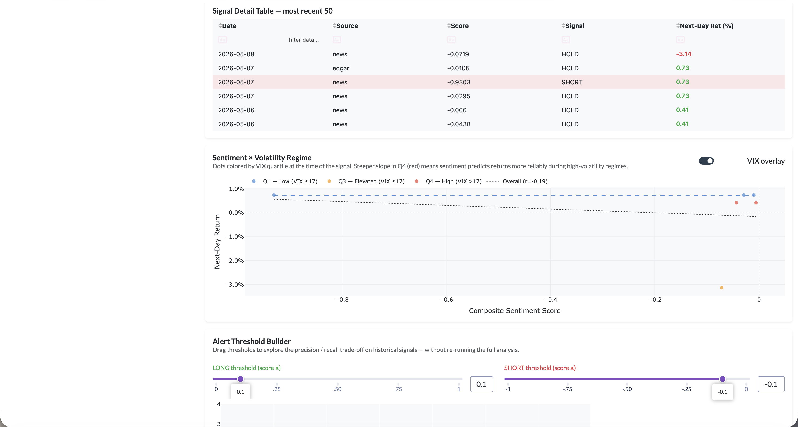
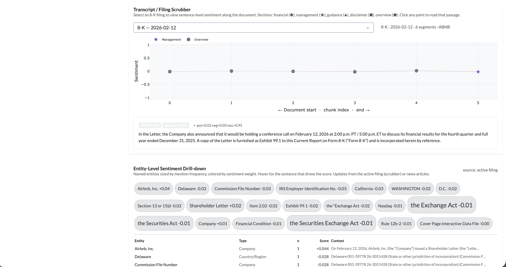

# finbert-signals

Sentiment-driven trading signal system that scores SEC EDGAR earnings filings and financial news with **FinBERT**, aligns scores to next-day price returns, and surfaces actionable insights through an interactive Dash dashboard.

---

## Screenshots







---

## What it does

1. **Fetches data** — SEC EDGAR 8-K filings (Exhibit 99.1 press releases) via the free EDGAR API; financial news via NewsAPI restricted to 15 reputable financial domains; OHLCV prices via yfinance.
2. **Scores sentiment** — runs [ProsusAI/FinBERT](https://huggingface.co/ProsusAI/finbert) locally (Apple Silicon MPS / CUDA / CPU) on chunked documents. Each chunk returns `positive`, `negative`, `neutral` probabilities; document score is a length-weighted average.
3. **Generates signals** — composite score = `positive − negative ∈ [−1, +1]`. Threshold-based rules produce LONG / HOLD / SHORT signals.
4. **Backtests** — event-driven paper trading: one trade per signal. Tracks equity curve vs. buy-and-hold benchmark, Sharpe ratio, max drawdown, and hit rate.
5. **Visualises** — full Dash dashboard on port 8052.

---

## Dashboard features

| Panel | Description |
|---|---|
| **Sentiment + Price timeline** | Daily average composite score (bars, coloured by signal) with stock close price overlay |
| **Equity curve** | Strategy vs. buy-and-hold; area fill |
| **Correlation scatter** | Sentiment score vs. next-day return, coloured by LONG / HOLD / SHORT |
| **Regime scatter** | Same scatter coloured by VIX quartile — surfaces whether sentiment predicts returns more strongly in high-volatility regimes |
| **Alert threshold builder** | Drag LONG / SHORT thresholds; histogram recolours instantly; precision / recall / F1 table updates live |
| **Transcript scrubber** | Sentence-level FinBERT profile of any stored filing — financial ◆, management ★, guidance ▲, disclaimer ■; click a point to read the passage |
| **Entity tag cloud** | spaCy NER extracts executives, products, macro terms; each entity scored by FinBERT on its context sentences; size ∝ mention count, colour ∝ sentiment |
| **Signal table** | Filterable / sortable table of every signal with date, source, score, direction, and next-day return |
| **Metric cards** | Total return, Sharpe ratio, max drawdown, hit rate, signal count |
| **Dark / light mode** | Bootstrap 5 `data-bs-theme` toggle |
| **CSV export** | One-click download of the current signal table |

---

## Tech stack

| Layer | Library |
|---|---|
| NLP model | `transformers` · `torch` · FinBERT (`ProsusAI/finbert`) |
| NER | `spacy` · `en_core_web_sm` |
| Data — filings | SEC EDGAR REST API (free, no key) |
| Data — news | NewsAPI (`everything` endpoint, free tier) |
| Data — prices / VIX | `yfinance` |
| Storage | SQLite (WAL mode) via `sqlite3` |
| Dashboard | `dash` · `dash-bootstrap-components` · `plotly` |
| Numerics | `pandas` · `numpy` · `scipy` |

---

## Quickstart

### 1. Clone and create environment

```bash
git clone https://github.com/maanitmehta/finbert-signals.git
cd finbert-signals
python -m venv venv && source venv/bin/activate
pip install -r requirements.txt
python -m spacy download en_core_web_sm
```

> `torch` + `transformers` is ~2 GB. Install once; FinBERT is cached after the first load.

### 2. Configure API keys

```bash
cp .env.template .env
# Edit .env and add your NewsAPI key (free at newsapi.org)
```

```
NEWSAPI_KEY=your_key_here
EDGAR_USER_AGENT=YourName/1.0 your@email.com
```

SEC EDGAR requires a descriptive User-Agent string per their [access policy](https://www.sec.gov/os/accessing-edgar-data).

### 3. Initialise the database

```bash
python db.py
```

### 4. Run the dashboard

```bash
python run.py
# Open http://127.0.0.1:8052
```

Select a ticker, click **Run Analysis** — the app fetches 30 days of domain-filtered news, up to 10 EDGAR 8-K filings, and price history; scores all documents with FinBERT; then renders all charts.

---

## Project structure

```
finbert-signals/
├── run.py                  # Entry point (port 8052)
├── config.py               # Paths, env vars
├── db.py                   # SQLite schema + migrations
├── tickers.py              # S&P 500 ticker list (Wikipedia, 7-day cache)
│
├── fetchers/
│   ├── edgar.py            # SEC EDGAR 8-K + Exhibit 99.1 fetcher
│   ├── news.py             # NewsAPI fetcher (domain whitelist + relevance filter)
│   └── prices.py           # yfinance OHLCV + next-day return
│
├── nlp/
│   ├── chunker.py          # Sentence-boundary text splitter (≤400 words)
│   ├── scorer.py           # FinBERT batched inference (MPS/CUDA/CPU)
│   ├── aggregator.py       # Length-weighted chunk → document score
│   ├── pipeline.py         # DB scoring pipeline (idempotent)
│   ├── segmenter.py        # Filing segmenter for transcript scrubber
│   └── entity_scorer.py    # spaCy NER + per-entity FinBERT scoring
│
├── signals/
│   ├── aligner.py          # Forward-fill join: sentiment → next-day return
│   ├── generator.py        # Threshold → LONG / HOLD / SHORT signals
│   └── correlation.py      # Pearson / Spearman + bucket stats
│
├── backtest/
│   ├── engine.py           # Event-driven paper trading
│   └── metrics.py          # Sharpe, max drawdown, hit rate
│
└── dashboard/
    └── app.py              # Dash layout + all callbacks
```

---

## Data pipeline

```
SEC EDGAR API          NewsAPI (financial domains)      yfinance
      │                         │                           │
      ▼                         ▼                           ▼
  filings table           articles table               prices table
  (Exhibit 99.1)       (relevant = 1 filter)        (next_day_return)
      │                         │                           │
      └──────────┬──────────────┘                           │
                 ▼                                          │
          FinBERT scoring                                   │
       (batched, MPS-accelerated)                          │
                 │                                          │
                 ▼                                          │
        sentiment_scores table                             │
                 │                                          │
                 └──────────────────┬───────────────────────┘
                                    ▼
                         Forward-fill aligner
                    (event date → next trading day)
                                    │
                                    ▼
                          Signal generator
                      (composite_score vs thresholds)
                                    │
                          ┌─────────┴─────────┐
                          ▼                   ▼
                    Backtest engine      Correlation stats
                  (equity curve, Sharpe)  (Pearson, Spearman)
```

---

## Noise filtering

NewsAPI free tier returns off-topic articles when searching company names. Three filters are applied:

1. **Domain whitelist** — queries restricted to 15 financial publishers (Reuters, CNBC, MarketWatch, Seeking Alpha, FT, WSJ, Bloomberg, …)
2. **Query construction** — `"AAPL"` OR `("Apple" AND financial-terms)` ensures company-name hits require financial context
3. **Relevance flag** — post-fetch check marks `articles.relevant = 0` for articles where neither the ticker nor the company name appears with a financial keyword; excluded from scoring and alignment

---

## Results (AAPL, 30-day window, domain-filtered news)

| Metric | Value |
|---|---|
| Pearson r (sentiment vs next-day return) | +0.100 |
| Spearman r | +0.286 |
| LONG signal hit rate | 71.4% |
| SHORT signal hit rate | 50.0% |
| Backtest Sharpe ratio | 2.69 |
| Max drawdown | −3.3% |

Signal quality improves as the database accumulates daily incremental news fetches from domain-filtered sources.

---

## Notes

- **EDGAR 8-K content**: the fetcher prioritises Exhibit 99.1 (the actual earnings press release) over the short cover page. For tickers without filed exhibits, it falls back to the primary document.
- **FinBERT on SEC filings**: FinBERT was trained on financial news text, so composite scores on formal regulatory language tend to cluster near −0.02. Earnings press releases (Exhibit 99.1) produce more meaningful variation.
- **NewsAPI free tier**: 100 requests/day; articles up to 30 days old. The dashboard does one incremental fetch per ticker per session (3-day window), so the limit is rarely reached in normal use.
